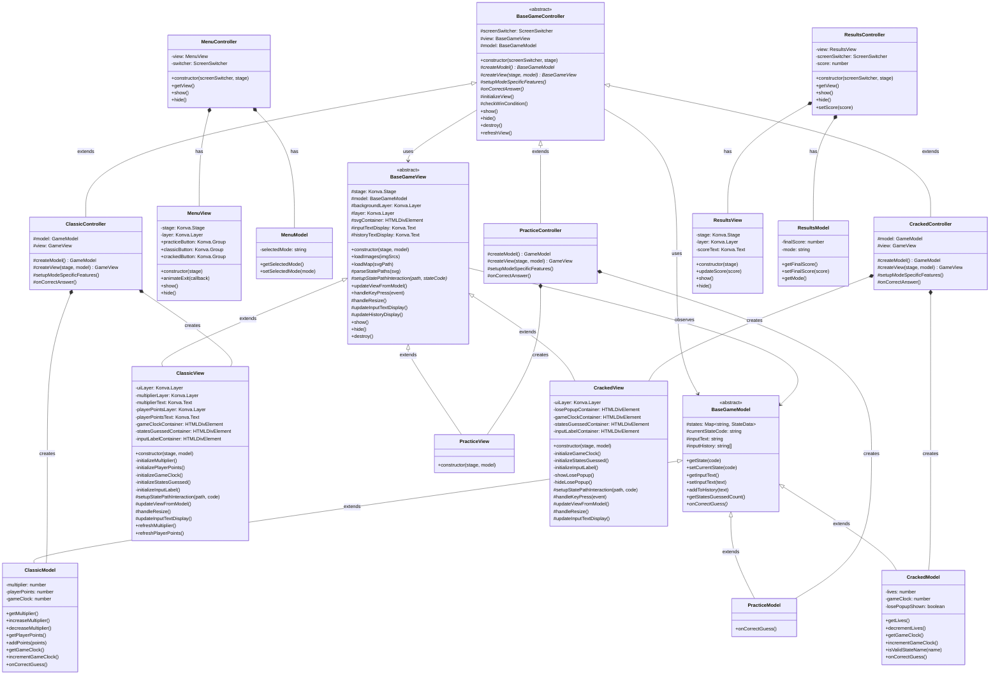
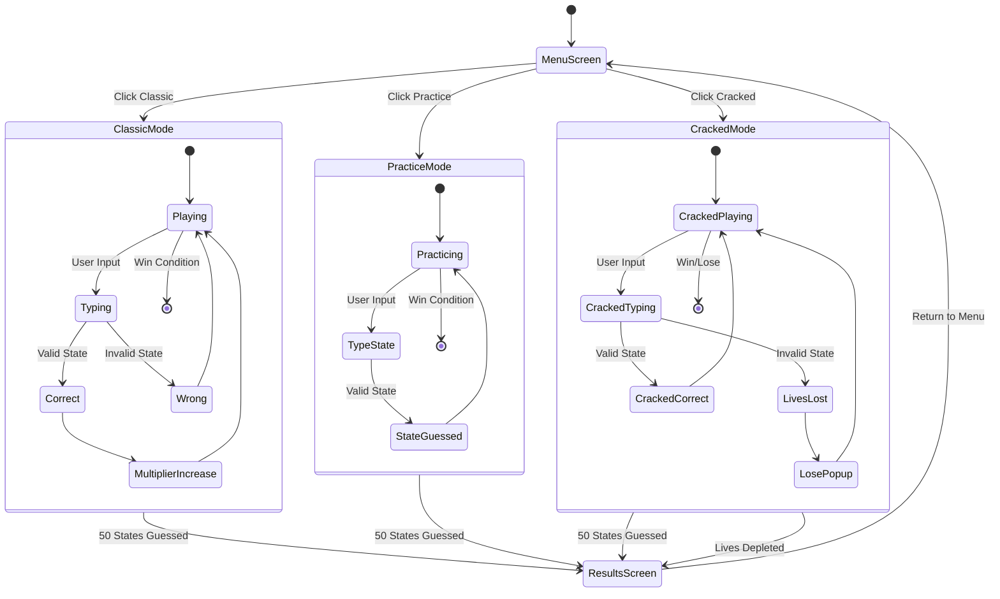
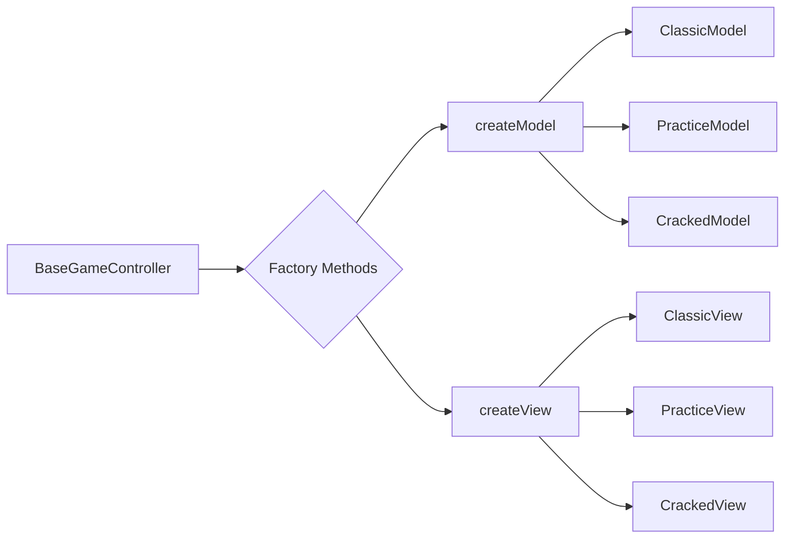
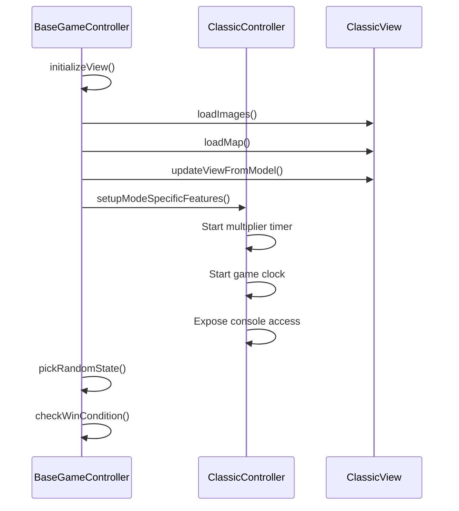

# Game Screens Architecture

> Complete application flow from Menu → Game Modes → Results with MVC architecture using Base classes for shared logic

## Architecture Overview Class Diagram

## Application Flow Diagram

## File Structure

```mermaid
graph TD
    A[src/] --> B[common/]
    A --> C[Screens/]
    
    B --> B1[BaseGameController.ts<br/>131 lines]
    B --> B2[BaseGameView.ts<br/>553 lines]
    B --> B3[BaseGameModel.ts]
    B --> B4[USMapData.ts]
    
    C --> D[MenuScreen/]
    C --> E[GameScreen Classic Mode/]
    C --> F[Game Screen Practice Mode/]
    C --> G[Game Screen Cracked Mode/]
    C --> H[ResultsScreen/]
    
    D --> D1[MenuController.ts<br/>56 lines]
    D --> D2[MenuView.ts]
    D --> D3[MenuModel.ts]
    
    E --> E1[classicController.ts<br/>59 lines]
    E --> E2[classicView.ts<br/>360 lines]
    E --> E3[classicModel.ts]
    
    F --> F1[practiceController.ts<br/>37 lines]
    F --> F2[practiceView.ts<br/>37 lines]
    F --> F3[practiceModel.ts]
    
    G --> G1[crackedController.ts<br/>45 lines]
    G --> G2[crackedView.ts<br/>357 lines]
    G --> G3[crackedModel.ts]
    
    H --> H1[ResultsController.ts<br/>32 lines]
    H --> H2[ResultsView.ts]
    H --> H3[ResultsModel.ts]
    
    style B1 fill:#e1f5ff
    style B2 fill:#e1f5ff
    style B3 fill:#e1f5ff
    style E1 fill:#fff3cd
    style E2 fill:#fff3cd
    style F1 fill:#d1ecf1
    style F2 fill:#d1ecf1
    style G1 fill:#f8d7da
    style G2 fill:#f8d7da
```

## Design Patterns Applied

### Factory Method Pattern
**Location**: `BaseGameController`
- **Abstract Methods**: `createModel()`, `createView()`
- **Purpose**: Allows child controllers to instantiate mode-specific Models and Views
- **Benefit**: Polymorphic object creation without knowing concrete classes

### Template Method Pattern
**Location**: `BaseGameController.initializeView()`
- **Invariant Steps**: Load images → Load map → Sync model → Setup callback
- **Variable Steps**: `setupModeSpecificFeatures()`, `onCorrectAnswer()`
- **Purpose**: Define skeleton of algorithm, let subclasses override specific steps

### Hook Method Pattern
**Location**: Multiple override points in Base classes
- **Methods**: `setupStatePathInteraction()`, `updateViewFromModel()`, `handleKeyPress()`, `handleResize()`
- **Purpose**: Allow child classes to inject custom behavior at specific points
- **Benefit**: Optional customization without breaking base functionality

## Architecture Principles

### Chapter 8: Increase Cohesion
**Applied To**: `BaseGameView`
- **Problem**: View responsibilities were scattered and duplicated across modes
- **Solution**: Consolidated all rendering logic (images, SVG, input, history) into base class
- **Result**: Single Responsibility - BaseGameView handles all visual rendering

### Chapter 14: Conceptual Integrity  
**Applied To**: `BaseGameController`
- **Problem**: Controllers had mode-specific conditional logic, breaking consistency
- **Solution**: Normalized interface using polymorphism (`model.onCorrectGuess()`)
- **Result**: Consistent API across all game modes, no conditional branching

## Code Metrics

### Controller Size Reduction

| Component | Before | After | Reduction |
|-----------|--------|-------|-----------|
| Classic Controller | 123 lines | 59 lines | **52% ↓** |
| Practice Controller | 77 lines | 37 lines | **52% ↓** |
| Cracked Controller | 95 lines | 45 lines | **53% ↓** |
| **Total** | **295 lines** | **141 + 131 (base) = 272** | **8% ↓** |

### Benefits
- ✅ **52% average reduction** in child controller code
- ✅ **Single source of truth** for shared game logic
- ✅ **Consistent interface** across all modes (conceptual integrity)
- ✅ **Easier extensibility** for new game modes
- ✅ **Polymorphic interactions** eliminate conditional logic

## Developer Features

### Classic Mode
- 🕐 **Game Clock** (yellow, top-left, 1% offset)
- 📊 **States Guessed Counter** (below game clock)
- ⌨️ **Input Label** (above input box)
- 🖱️ **State Clicking** (developer flag)
- 🔍 **Console Access** (`window.gameModel`, `window.gameController`)

### Practice Mode
- 🚫 **No developer features** (pure minimal practice mode)

### Cracked Mode
- 🕐 **Game Clock** (yellow, top-left, 2% offset)
- 📊 **States Guessed Counter** (below game clock)
- ⌨️ **Input Label** (above input box)
- 🖱️ **State Clicking** (developer flag)
- ❌ **Lose Popup** (triggers on invalid state, blocks input)
- ✅ **Invalid State Detection** (validates state names)

### Styling Specifications
- **Color**: Yellow text (`#ffff00`) on black background (`#000000`)
- **Font**: Arial, bold
- **Position**: Top-left corner with responsive offsets (1-2% of window size)
- **Behavior**: Non-blocking (`pointerEvents: 'none'`), repositions on resize
- **z-index**: 10000 (always on top)
